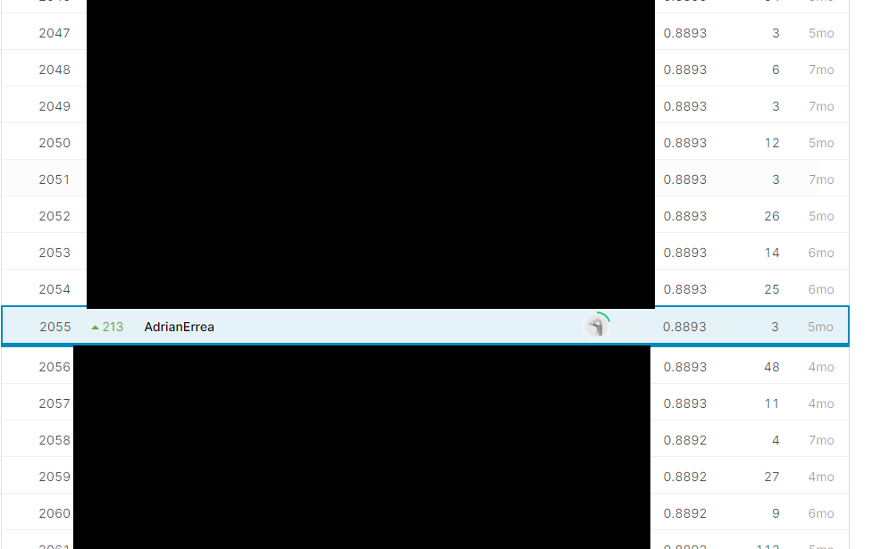
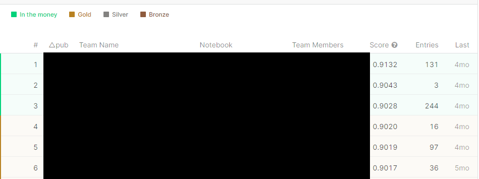

# Kaggle-Cassava-Leaf-Disease-Classification

## Description
The main goal is to classify each image in one of five possible classes. The train dataset contains 21397 images with their labels and the test dataset contains around 15000 images.

## Links

Home page: https://www.kaggle.com/c/cassava-leaf-disease-classification

## Leaderboard

Not so good if we look at the final position (2055) but only 0.0239 (_categorization accuracy_ was the metric) worse than the winner out of 3900 competitors

## Final Comments

+ I did not spend so much time trying to improve the metric. In fact, I only made 3 submissions.
+ It was one of my first kaggle competitions and I was focused more on the environment in Kaggle than in the competition problem itself
+ I need to understand the problem deeper if I want to try more things to get a better performance: what augmentations to use, using other external datasets and so on 

